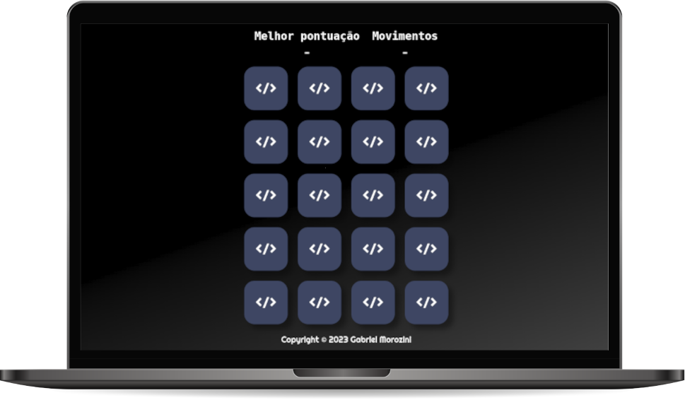

[Visualizar Projeto](https://gabrielmorozini.com.br/jogoMemoria/)

## 📚 Sobre o projeto 

 

Neste projeto foi desenvolvido uma versão eletrônica do clássico Jogo da Memória. Utilizando HTML, CSS e JavaScript, foi criado um jogo divertido e educativo, que desafia a memória e concentração dos jogadores.

A versão eletrônica do Jogo da Memória apresenta uma interface visualmente atraente e de fácil utilização. O HTML foi utilizado para estruturar a página do jogo, o CSS permitiu a estilização das cartas e do tabuleiro, enquanto o JavaScript foi responsável pela lógica e interações do jogo.

A mecânica do jogo é simples e intuitiva. Os jogadores se deparam com um conjunto de cartas viradas para baixo no tabuleiro e devem clicar em duas cartas para encontrar um par correspondente. Caso as cartas sejam iguais, elas permanecem viradas para cima. Caso contrário, elas são viradas novamente, e o jogador deve lembrar-se das posições para tentar novamente. O objetivo é encontrar todos os pares de cartas no menor número de movimentos possível.

Desenvolver esse projeto me proporcionou a oportunidade de aplicar conceitos fundamentais de programação, como manipulação do DOM, eventos, estruturas de controle e manipulação de dados. Além disso, fortaleceu minhas habilidades de resolução de problemas e pensamento lógico.

Em resumo, a versão eletrônica do Jogo da Memória desenvolvida no curso Programador BR é um jogo divertido e educativo, que combina elementos visuais atraentes com a emoção de encontrar pares de cartas correspondentes.

Para visualizar o projeto basta acessar 
[gabrielmorozini.com.br](https://gabrielmorozini.com.br) ou [clicando aqui!](https://gabrielmorozini.com.br/jogoMemoria/)

 

## 🖥️ Tecnologias utilizadas

* HTML
* CSS
* JavaScript

 

## ✒️ Licença
Esse projeto está sob licença MIT. Leia o arquivo <a href="./LICENSE" >LICENSE</a> para mais detalhes. 

  

  
  
       

